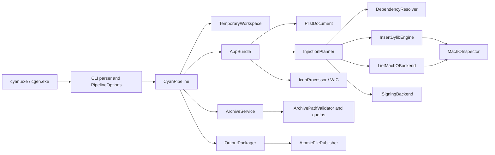

# Architecture

## Goals and invariants

`cyan-cpp` is a native Windows x64 C++20 rewrite of cyan 1.4.4. The core
invariants are:

- no Python, WSL, macOS, Xcode, Bash, zsign, or Unix command dependency;
- no mutable global state or owning raw pointers;
- filesystem APIs accept `std::filesystem::path`;
- user-visible Windows paths remain UTF-16 at OS boundaries;
- input is never modified until a complete result has passed verification;
- archives and Mach-O offsets are treated as hostile input;
- signing is separate from injection and never reports a false success;
- native Mach-O injection runs first, LIEF fallback is explicit in the log,
  and verification is independent of the selected writer.

## Component view



## Libraries and ownership

| Target/module | Responsibilities | Third-party boundary |
| --- | --- | --- |
| `cyan_core` | Results/errors, options, CLI parsing and RAII workspace | None |
| `cyan_archive` | IPA/TIPA/DEB/`.cyan`, secure extraction and ZIP output | libarchive |
| `cyan_plist` | Typed plist values, XML/binary parse/write, metadata edits | shared libplist |
| `cyan_macho` | Bounds-checked thin/FAT parse, inspection and injection | None |
| `cyan_lief` | Public LIEF API adapter for edit/rebuild/fallback | LIEF 0.17.6 |
| `cyan_signing` | `ISigningBackend`, entitlement ordering, bounded process adapter | Bundled Procursus `ldid.exe`; optional path override |
| `cyan_image` | COM RAII, WIC decode/scale/PNG encode | Windows SDK |
| `cyan_bundle` | App discovery, metadata, extension/watch and encryption policy | plist, native Mach-O |
| `cyan_pipeline` | Transaction orchestration and output publication | All adapters |
| `cyan` | User CLI and logging | All application libraries |
| `cgen` | `.cyan` producer CLI | archive, JSON, plist validation |

Headers exposed by one adapter do not leak dependency types into another.
This keeps the native parser testable without LIEF and prevents signing policy
from becoming part of binary injection.

## Structured result model

Operations return a value-or-error result. Errors contain:

- a stable enum/code;
- a human-readable UTF-8 message;
- the path and operation where relevant;
- an optional nested cause;
- whether a LIEF fallback is safe.

Expected malformed input is not represented by exceptions across module
boundaries. Exceptions from filesystem or third-party code are caught at the
adapter boundary and translated. Programmer errors may still fail fast in
tests.

## Pipeline transaction

1. Parse and validate options without mutating input.
2. Create an unpredictable workspace owned by an RAII object.
3. Extract/copy into `workspace/Payload` using security policy.
4. Discover the app and take an in-memory semantic snapshot.
5. Inspect encryption and collect entitlement/signature state.
6. Apply ordered `.cyan` overlays.
7. Apply removals, injection, metadata, signing and thinning in cyan order.
8. Verify the app tree, plists and every modified Mach-O.
9. Write to a temporary sibling of the final path.
10. Flush/close, validate the published artifact, and atomically replace the
    destination.
11. Destroy the workspace on every exit path.

For a default in-place operation, step 10 is the only point at which the
original can change.

## Archive security model

Archive entry names are decoded once, normalised lexically, and rejected when
they contain:

- an absolute/rooted/UNC/drive-qualified path;
- `..` components (`.` components are discarded during lexical normalisation);
- an empty archive name or embedded NUL;
- backslash-based traversal after separator normalisation;
- an NTFS alternate-data-stream colon;
- a trailing dot/space component;
- a Windows device basename (`CON`, `NUL`, `COM1`, and related names);
- a duplicate case-folded normalised path.

Extraction manually creates directories and regular files beneath an already
canonicalised root. Archive-created symlinks, hardlinks, reparse points and
special files are rejected. A component is rechecked before each file open.
The conventional POSIX tar root directory entry `./` is ignored; a regular
file that normalises to the extraction root is rejected.
Limits cover entry count, per-entry bytes, total expanded bytes and expansion
ratio. Partially written files stay inside the temporary workspace.

## Native Mach-O model

The parser reads bytes explicitly; it does not map untrusted structures over
unaligned memory. Checked add/multiply/alignment helpers guard every offset.
Supported containers:

- little/big-endian Mach-O 32 and 64;
- big/little-endian FAT32 and FAT64;
- multiple non-overlapping slices.

`InsertDylibEngine` performs a plan-then-commit operation for every slice:

1. Parse all headers/load commands and reject invalid command sizes/ranges.
2. Detect an exact existing dylib command.
3. If requested, validate that `LC_CODE_SIGNATURE` is the final command, its
   blob ends at the slice end, and `__LINKEDIT` is the terminal file region.
4. Calculate the aligned 24-byte-plus-name dylib command.
5. Find the first file-backed content offset and prove the expanded command
   table fits. In safe mode the target padding must be zero.
6. Repair `__LINKEDIT` file/vm sizes and `LC_SYMTAB.strsize` when stripping
   terminal signature padding.
7. Write the new command and header counters to a new slice buffer.
8. Rebuild FAT containers with each recorded alignment exponent, updating all
   offsets/sizes.
9. Reparse the output and verify the dependency and signature state.
10. Atomically publish.

Errors from space/layout checks are eligible for the LIEF fallback; arithmetic,
boundary and invalid-container failures are not.

## LIEF 0.17.6 adapter

Only APIs confirmed in the pinned headers are used:

- `LIEF::MachO::Parser::parse`;
- `FatBinary::take`;
- `Binary::libraries`, `find_library`, `remove_signature`, `add`, and `write`;
- `DylibCommand::weak_dylib` / `load_dylib`;
- `RPathCommand::create`;
- encryption and code-signature load-command objects.

The adapter logs `backend=LIEF` and writes to a separate temporary file.
Success is accepted only after the native inspector reparses that file.

## Signing model

```cpp
class ISigningBackend {
public:
  virtual ~ISigningBackend() = default;
  virtual Result extractEntitlements(
      const std::filesystem::path&, PlistDocument&) = 0;
  virtual Result removeSignature(const std::filesystem::path&) = 0;
  virtual Result signAdHoc(
      const std::filesystem::path&,
      const std::optional<PlistDocument>&) = 0;
};
```

The default release backend is the official Windows x64 Procursus `ldid.exe`
2.1.5-procursus7, discovered beside `cyan.exe`. It extracts the original XML
entitlement slot before signature-removing mutations and performs ad-hoc
signing afterwards. `--ldid PATH` overrides the bundled executable.

Windows process creation uses an argument vector/quoted command line without a
shell. Exit status is checked, temporary entitlement files are RAII-owned, and
the native inspector verifies that every output slice contains a signature.
With no packaged or explicitly configured backend, `--fakesign` returns
`SigningBackendUnavailable`.

## Concurrency

The pipeline is single-transaction and deterministic. Independent inspection
or icon operations may later use a bounded executor, but no component changes
the process current directory. libarchive, LIEF and COM objects stay local to
the owning operation.

## Compatibility modes

Default mode prioritises integrity and rejects unsafe load-command overwrite,
links, device names and ambiguous archive collisions.
`--compatibility-mode cyan` may reproduce non-security-sensitive collision and
message semantics and treats insert-dylib confirmations like `--all-yes`. It
never disables path containment, arithmetic checks, atomic output, or
post-write verification.
